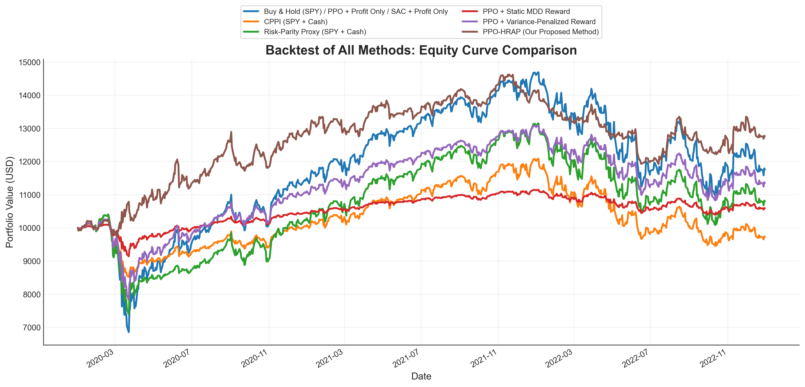
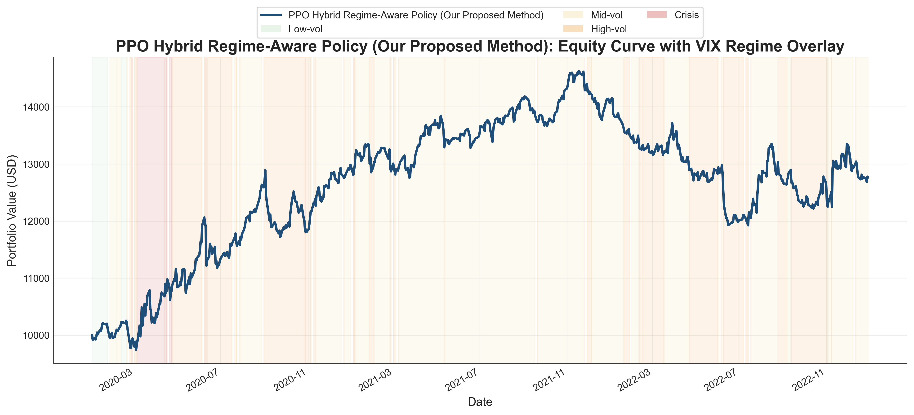
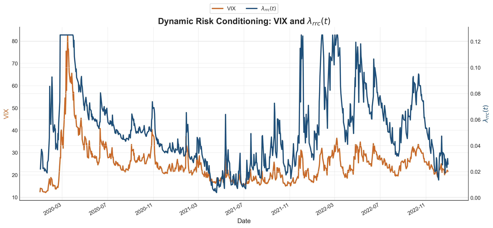
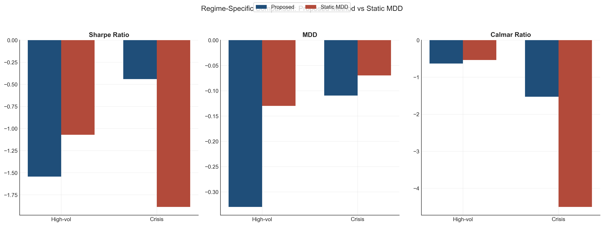
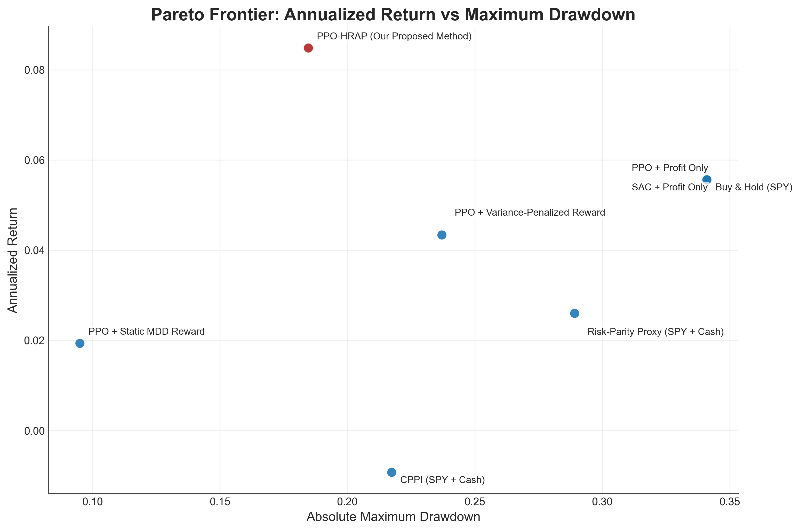

# PPO Hybrid Regime-Aware Policy for RL Trading

This repository is a research-oriented reinforcement learning trading framework built around a single-asset allocation problem: trading `SPY` against cash under changing volatility regimes. The project benchmarks several reward designs and financial baselines, then evaluates a final proposed method, **PPO Hybrid Regime-Aware Policy (PPO-HRAP)**, which combines drawdown-aware reward shaping, VIX-conditioned risk control, and a regime-guided action prior.

## Highlights

- Unified `Gymnasium` trading environment with injective reward design.
- Financial baselines: Buy & Hold, Risk-Parity proxy, and CPPI.
- RL baselines: PPO/SAC with profit-only reward, PPO with variance penalty, PPO with static Markovian MDD reward.
- Proposed method: **PPO-HRAP**, a hybrid policy that uses:
  - dynamic risk aversion through VIX-based conditioning,
  - trend-aware directional priors,
  - PPO fine-tuning around a regime-aware target exposure.
- Full train/validation/test split with benchmark outputs, regime analysis, and paper-ready figures.

## Method Overview

The final proposed method is not a pure reward-only design. It is a **hybrid control policy**:

1. **Reward shaping**

```text
reward_t
= log_return_t
- lambda_rrc(t) * drawdown_increase_t
- beta_target * (target_weight_t - desired_weight_t)^2
- beta_turnover * turnover_t
```

2. **Dynamic risk conditioning**

```text
lambda_rrc(t) = lambda_base * (1 + alpha * clamp(vix_zscore_t, -3, 3))
```

3. **Regime-aware target exposure**

The policy uses SPY trend and VIX stress signals to define a desired exposure profile:

- bullish and calm: aggressive long
- bullish but stressed: reduced long
- bearish and stressed: light defensive short / near-flat exposure
- crisis: stronger short bias

4. **Action blending**

The executed target weight is a blend between PPO output and the regime prior:

```text
target_weight_t
= (1 - action_prior_weight) * raw_action_t
+ action_prior_weight * desired_weight_t
```

This design keeps PPO flexible while discouraging pathological full-long behavior in stressed markets.

## Benchmark Summary

Test period: **2020-01-01 to 2022-12-31**

| Method | Total Return | Annualized Return | Sharpe | Sortino | Calmar | MDD |
|---|---:|---:|---:|---:|---:|---:|
| Buy & Hold (SPY) | 0.1760 | 0.0556 | 0.3420 | 0.4251 | 0.1630 | -0.3410 |
| Risk-Parity Proxy (SPY + Cash) | 0.0799 | 0.0260 | 0.2281 | 0.2848 | 0.0898 | -0.2892 |
| CPPI (SPY + Cash) | -0.0275 | -0.0093 | -0.0021 | -0.0026 | -0.0427 | -0.2174 |
| PPO + Profit Only | 0.1760 | 0.0556 | 0.3420 | 0.4251 | 0.1630 | -0.3410 |
| SAC + Profit Only | 0.1760 | 0.0556 | 0.3420 | 0.4251 | 0.1630 | -0.3410 |
| PPO + Variance-Penalized Reward | 0.1356 | 0.0434 | 0.3384 | 0.4208 | 0.1829 | -0.2371 |
| PPO + Static MDD Reward | 0.0591 | 0.0193 | 0.3341 | 0.4153 | 0.2034 | -0.0951 |
| **PPO-HRAP (Our Proposed Method)** | **0.2762** | **0.0848** | **0.6447** | **0.8588** | **0.4592** | **-0.1847** |

Primary result file: [results/tables/ppo_hybrid_regime_aware_policy/proposed_method_metrics.csv](results/tables/ppo_hybrid_regime_aware_policy/proposed_method_metrics.csv)

## Figures

### All-Method Equity Comparison



### Proposed Method With VIX Regime Overlay



### Dynamic Risk Conditioning: VIX vs Lambda



### Proposed vs Static MDD in Stress Regimes



### Pareto Frontier



## Repository Structure

```text
PPO_Hybrid_Regime_Aware_Policy/
|-- baselines/
|   |-- financial/
|   |   `-- financial_baselines.py
|   |-- rl/
|   |   |-- rl_baseline_common.py
|   |   |-- evaluate_rl_baselines.py
|   |   |-- run_all_rl_baselines.py
|   |   |-- train_ppo_profit_only.py
|   |   |-- train_sac_profit_only.py
|   |   |-- train_ppo_variance_penalized.py
|   |   `-- train_ppo_markovian_mdd_static.py
|   |-- ppo_hybrid_regime_aware_policy/
|   |   |-- pipeline.py
|   |   `-- run_proposed_method.py
|   |-- analysis_utils.py
|   `-- metrics.py
|-- data/
|   |-- crawl_data.py
|   |-- preprocess_indicator_signals.py
|   |-- raw/
|   `-- processed/
|-- env/
|   `-- trading_env.py
|-- reward/
|   |-- profit_only.py
|   |-- variance_penalized.py
|   |-- differential_sharpe.py
|   |-- markovian_mdd_static.py
|   |-- ppo_hybrid_regime_aware_policy.py
|   `-- rrc.py
|-- results/
|   |-- figures/
|   |-- models/
|   `-- tables/
|-- requirements.txt
`-- README.md
```

## Data

### Universe

- Risky asset: `SPY`
- Risk signal: `^VIX`
- Portfolio: `SPY` + cash

### Splits

- Train: `2010-01-01` to `2017-12-31`
- Validation: `2018-01-01` to `2019-12-31`
- Test: `2020-01-01` to `2022-12-31`

### Processed Features

Core market features used in the environment and proposed method include:

- `log_return`
- `sma_ratio`
- `rsi_14`
- `bollinger_band_width`
- `vix_zscore_252`
- `ret_5d`
- `ret_20d`
- `ma_spread_5_20`
- `vix_change_5d`

Processed datasets:

- [data/processed/spy_vix_indicators_train.csv](data/processed/spy_vix_indicators_train.csv)
- [data/processed/spy_vix_indicators_validation.csv](data/processed/spy_vix_indicators_validation.csv)
- [data/processed/spy_vix_indicators_test.csv](data/processed/spy_vix_indicators_test.csv)

## Reward Library

Implemented reward functions:

- `profit_only` / `r0`
- `variance_penalized` / `r1`
- `differential_sharpe` / `r2`
- `markovian_mdd` / `r3`
- `ppo_hybrid_regime_aware_policy` / `ppo_hrap` / `hrap`

The reward API is callable and environment-friendly:

```python
reward = reward_fn(env, transition)
```

Main environment file: [env/trading_env.py](env/trading_env.py)

## Installation

```powershell
python -m venv .venv
.\.venv\Scripts\python -m pip install -r requirements.txt
```

Main dependencies:

- `pandas`
- `numpy`
- `yfinance`
- `gymnasium`
- `matplotlib`
- `stable-baselines3`

## Reproducibility

### 1. Download and preprocess data

```powershell
.\.venv\Scripts\python data\crawl_data.py
.\.venv\Scripts\python data\preprocess_indicator_signals.py
```

### 2. Run financial baselines

```powershell
.\.venv\Scripts\python baselines\financial\financial_baselines.py
```

### 3. Run RL baselines

```powershell
.\.venv\Scripts\python baselines\rl\run_all_rl_baselines.py
```

### 4. Run the proposed method

```powershell
.\.venv\Scripts\python baselines\ppo_hybrid_regime_aware_policy\run_proposed_method.py
```

## Key Output Files

### Proposed method

- [results/tables/ppo_hybrid_regime_aware_policy/proposed_method_metrics.csv](results/tables/ppo_hybrid_regime_aware_policy/proposed_method_metrics.csv)
- [results/tables/ppo_hybrid_regime_aware_policy/proposed_method_portfolios.csv](results/tables/ppo_hybrid_regime_aware_policy/proposed_method_portfolios.csv)
- [results/tables/ppo_hybrid_regime_aware_policy/best_config.json](results/tables/ppo_hybrid_regime_aware_policy/best_config.json)

### Aggregate comparisons

- [results/tables/all_methods_metrics.csv](results/tables/all_methods_metrics.csv)
- [results/tables/all_methods_regime_metrics.csv](results/tables/all_methods_regime_metrics.csv)

### Baseline tables

- [results/tables/financial baselines/financial_baselines_metrics.csv](<results/tables/financial baselines/financial_baselines_metrics.csv>)
- [results/tables/rl_baselines/rl_baselines_metrics.csv](results/tables/rl_baselines/rl_baselines_metrics.csv)

## Current Status

This repository is now in a solid **benchmark-ready research state**:

- environment design is stable,
- baseline pipelines are implemented,
- the proposed hybrid policy is trained and evaluated,
- figures are regenerated from the latest results,
- outputs are organized for analysis and paper writing.

The next natural extensions are:

- multi-seed evaluation,
- transaction-cost sensitivity studies,
- ablation of action prior vs reward shaping,
- additional assets and multi-asset allocation.

## License / Usage Note

This repository is structured as an academic research prototype. Please verify assumptions, data handling, and evaluation settings before reusing it for production trading.
